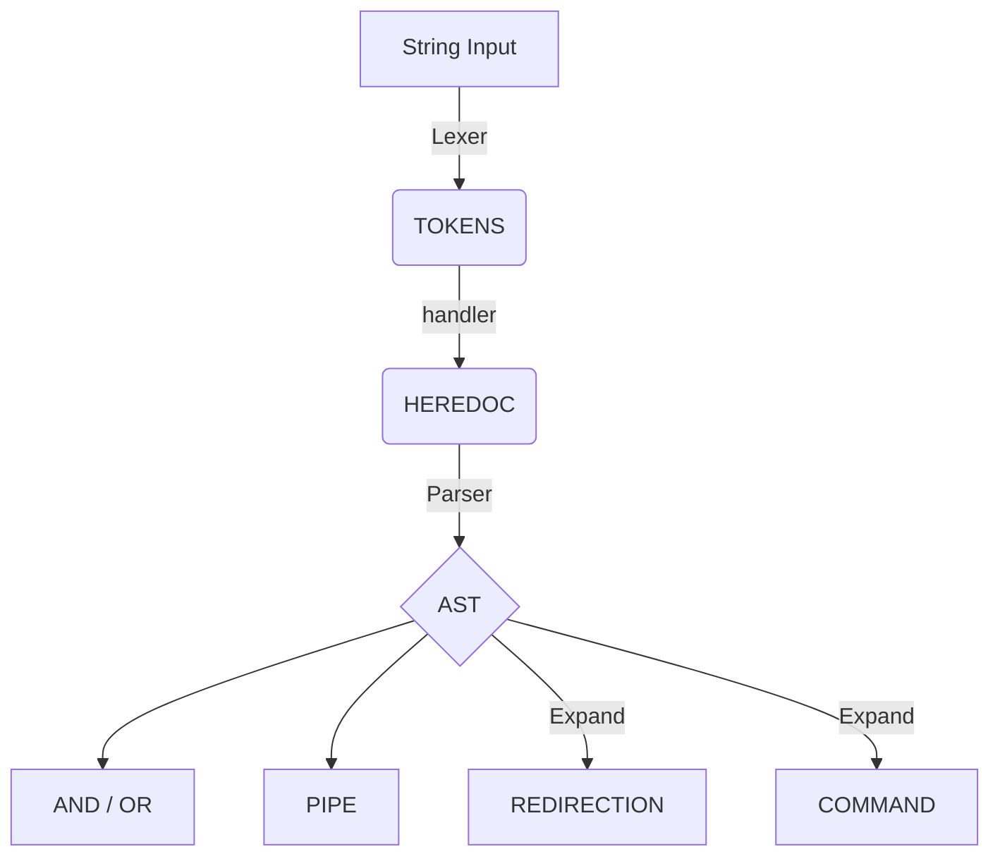

<div align="center">


</div>


## 📖 Overview

The aim of the `minishell` 42 project is to create a lightweight command-line interpreter that reproduces the essential features of bash. What sets this implementation apart is its robust parsing system, completely decoupled from execution, built on LALR(1) grammar principles, producing a clean and efficient Abstract Syntax Tree (AST) for command execution. This project demonstrates advanced parsing techniques and provides a solid basis for understanding how some modern shells interpret and execute commands. A UNIX command-line interpreter focusing on advanced parsing techniques with LALR(1) grammar

## ✨ Key benefits

### Parsing Architecture

- **Tokenizer**: Flexible and scalable lexical analyzer that converts raw input into meaningful tokens
- **LALR(1) Grammar Parser**: Predictive parsing using Look-Ahead LR(1) techniques
- **AST Generation**: Efficient Abstract Syntax Tree construction thanks to grammar production rules

### Execution Architecture

- **Efficient Builtins**: Implementation of essential shell builtins (cd, echo, exit, etc.)
- **Resource Management**: Sophisticated caching of file descriptors and memory allocations with automatic cleanup mechanisms on program exit
- **Hashmap-powered Environment**: Fast O(1) environment variables access

## 🚀 Getting Started

### Prerequisites

- Clang compiler
- GNU Make
- readline library

### Installation

```bash
# Clone the repository
git clone --recurse-submodules https://github.com/MykleR/minishell.git

# Enter the directory and compile project
cd minishell; make

# Run the shell
./minishell
```

## 🔍 Technical Overview

### LALR(1) Grammar

The heart of our shell's parsing capabilities lies in its LALR(1) (Look-ahead Left-to-right) grammar implementation
This grammar formally describes the language's syntax, enabling the parser to correctly process complex command structures including pipes, logical operators, and redirections.
```
program -> list  
list -> list AND list  
list -> list OR list  
list -> list PIPE list  
list -> LBRACKET list RBRACKET  
list -> command  
redirection -> REDIR_IN arg  
redirection -> REDIR_OUT arg  
redirection -> REDIR_APP arg  
command -> arg  
command -> redirection  
command -> command arg  
command -> command redirection  
arg -> ARG
```
- On the left side of each rule, you find productions, as the name suggests, these are used to create AST nodes.
- On the right side you find the requirements for the production, these may be tokens, but also other productions.

### LR Parsing Tables

The parser utilizes LALR derivation tables for deterministic command interpretation:
The tables are generated based on the grammar mentioned above and using the [LALR(1) Parser Generator](https://jsmachines.sourceforge.net/machines/lalr1.html) and integrated directly into the parsing engine. This approach enables deterministic, efficient parsing with predictable error handling.

```
┌───────────────────────────────────────────────────────┐
│                   ACTION TABLE                        │
├───────┬───────┬───────┬───────┬───────┬───────┬───────┤
│ STATE │  AND  │  OR   │ PIPE  │ LBRKT │ RBRKT │ REDIR │
├───────┼───────┼───────┼───────┼───────┼───────┼───────┤
│   0   │  s5   │  s6   │  s7   │  s1   │  r3   │  s11  │
│   1   │  r1   │  r1   │  r1   │  s1   │  r1   │  r1   │
│   ... │  ...  │  ...  │  ...  │  ...  │  ...  │  ...  │
└───────┴───────┴───────┴───────┴───────┴───────┴───────┘

┌───────────────────────────────────────┐
│            GOTO TABLE                 │
├───────┬───────┬───────┬───────┬───────┤
│ STATE │ list  │ cmd   │ redir │ arg   │
├───────┼───────┼───────┼───────┼───────┤
│   0   │   2   │   3   │   4   │   9   │
│   1   │   5   │   -   │   -   │   -   │
│   ... │  ...  │  ...  │  ...  │  ...  │
└───────┴───────┴───────┴───────┴───────┘
```

## 🔄 Processing Pipeline

The execution process follows a carefully designed pipeline:
1. **Input Capture**: Utilizes GNU Readline for command input with history support
2. **Tokenization**: Breaks input into meaningful tokens
3. **Heredoc Processing**: Handles heredocs and converts them to redirections '<'
4. **AST Construction**: Builds an abstract syntax tree using the LALR(1) parser
5. **Tree Traversal**: Executes commands through post-order traversal of the binary tree


## 🛠️ Implementation Deep Dive

### Parsing Process

1. **Lexical Analysis (Tokenizing)**
   - Input string is broken down into tokens (arg, operators, redirection, etc.)
   - Each token is classified based on its role in the shell language
   - You will find an exhaustive list of all the tokens type in “headers/lexer.h”.
   - Token enum type values are very important as they are used as index in the action table

2. **Syntax Analysis (Parsing)**
   - **State Machine**: The parser maintains a state stack and a symbol stack
   - **Action/Goto Tables**: Action and GOTO tables drive the parser's state transitions, For each state, consult the action table to determine:
   - Shift (s): Push the current token onto the stack and move to next token
   - Reduce (r): Replace symbols on stack according to a production rule
   - Accept (acc): Parsing successfully completed
   - Error (empty): Syntax errors
   - Syntax errors can be precisely located and reported easily thanks to the Error state

4. **AST Construction**
   - As grammar rules are recognized, corresponding AST nodes are created
   - Nodes are connected to form a tree structure representing the command hierarchy
   - The tree captures command relationships and execution order

5. **AST Traversal and Execution**
   - The AST is traversed in post-order to respect command dependencies
   - Nodes are processed according to their type (command, redirection, logical operator)
   - Execution results propagate up the tree to determine logical branch paths and exit code status

## 📚 Further Reading

- [Compilers: Principles, Techniques, and Tools](https://en.wikipedia.org/wiki/Compilers:_Principles,_Techniques,_and_Tools)
- [LALR Parser](https://en.wikipedia.org/wiki/LALR_parser)
- [LALR Parser Generator](https://jsmachines.sourceforge.net/machines/lalr1.html)
- [Abstract Syntax Trees in Compiler Design](https://en.wikipedia.org/wiki/Abstract_syntax_tree)
- [Compilation](https://vpenelle.pages.emi.u-bordeaux.fr/compilation/poly.pdf)
- [Grammaires et language](https://amuschol.pages.emi.u-bordeaux.fr/mpc/poly.pdf)
