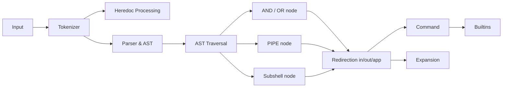

# 🐚 minishell

> A UNIX command-line interpreter focusing on advanced parsing techniques with LALR(1) grammar


## 📖 Overview

`minishell` is a lightweight command-line interpreter that replicates essential features of bash. What sets this implementation apart is its robust parsing system built on LALR(1) grammar principles, producing a clean and efficient Abstract Syntax Tree (AST) for command execution. This project demonstrates advanced parsing techniques and provides a solid foundation for understanding how modern shells interpret and execute commands.

## ✨ Key Features

### 🔄 Processing Pipeline



### 🧩 Parsing Architecture

- **Tokenizer**: Flexible and scalable lexical analyzer that converts raw input into meaningful tokens
- **LALR(1) Grammar Parser**: Predictive parsing using Look-Ahead LR techniques
- **AST Generation**: Efficient Abstract Syntax Tree construction representing command relationships

### 🔍 Technical Implementation

#### LALR(1) Grammar

The heart of the shell's parsing capabilities lies in its LALR(1) grammar implementation:

```
program -> list  
list -> list AND list  
list -> list OR list  
list -> list PIPE list  
list -> LBRACKET list RBRACKET  
list -> command  
redirection -> REDIR_IN arg  
redirection -> REDIR_OUT arg  
redirection -> REDIR_APP arg  
command -> arg  
command -> redirection  
command -> command arg  
command -> command redirection  
arg -> ARG
```

This grammar formally describes the language's syntax, enabling the parser to correctly process complex command structures including pipes, logical operators, and redirections.

#### LR Parsing Tables

The parser utilizes LR (Look-ahead Right-to-left derivation) tables for deterministic command interpretation:

```
┌───────────────────────────────────────────────────────┐
│                   ACTION TABLE                        │
├───────┬───────┬───────┬───────┬───────┬───────┬───────┤
│ STATE │  AND  │  OR   │ PIPE  │ LBRKT │ RBRKT │ REDIR │
├───────┼───────┼───────┼───────┼───────┼───────┼───────┤
│   0   │  s5   │  s6   │  s7   │  s1   │  r3   │  s11  │
│   1   │  r1   │  r1   │  r1   │  s1   │  r1   │  r1   │
│   ... │  ...  │  ...  │  ...  │  ...  │  ...  │  ...  │
└───────┴───────┴───────┴───────┴───────┴───────┴───────┘

┌───────────────────────────────────────┐
│            GOTO TABLE                 │
├───────┬───────┬───────┬───────┬───────┤
│ STATE │ list  │ cmd   │ redir │ arg   │
├───────┼───────┼───────┼───────┼───────┤
│   0   │   2   │   3   │   4   │   9   │
│   1   │   5   │   -   │   -   │   -   │
│   ... │  ...  │  ...  │  ...  │  ...  │
└───────┴───────┴───────┴───────┴───────┘
```

The tables are generated using the [LALR(1) Parser Generator](https://jsmachines.sourceforge.net/machines/lalr1.html) and integrated directly into the parsing engine. This approach enables deterministic, efficient parsing with predictable error handling.

#### AST Node Structure

The Abstract Syntax Tree uses a memory-efficient union-based node structure:

```c
typedef struct s_binary_expr
{
	t_ast	*left;
	t_ast	*right;
}	t_binary_expr;

typedef struct s_redir_expr
{
	t_ast			    *next;
	char			    *file;
	int				    fd;
	t_redir_type	type;
}	t_redir_expr;

typedef struct s_cmd_expr
{
	char  **argv;
  int    arc;
}	t_cmd_expr;

typedef union u_ast_expr
{
	t_binary_expr	binary;
	t_cmd_expr		cmd;
	t_redir_expr	redir;
	t_token			  *token; // For temporary token nodes
}	t_ast_expr;

struct s_ast
{
	t_ast_type	type;
	t_ast_expr	expr;
};
```

This design ensures a low memory footprint while maintaining the flexibility needed to represent diverse command structures.

### ⚙️ Additional Features

- **Efficient Builtins**: Implementation of essential shell builtins (cd, echo, exit, etc.) with hashmap-based environment variable management
- **Resource Management**: Sophisticated caching of file descriptors and memory allocations with automatic cleanup mechanisms
- **Signal Handling**: Proper handling of terminal signals (CTRL+C, CTRL+D, etc.)
- **Environment Variable Expansion**: Support for variable substitution and expansion

## 🛠️ Implementation Deep Dive

### Parsing Process

1. **Lexical Analysis (Tokenizing)**
   - Input string is broken down into tokens (words, operators, etc.)
   - Each token is classified based on its role in the shell language
   - You will find an exhaustive list of all the tokens type in “headers/lexer.h”.
   - Token enum type value is very important as it is used as index in the action table

2. **Syntax Analysis (Parsing)**
   - Tokens are analyzed according to LALR(1) grammar rules
   - Action and GOTO tables drive the parser's state transitions
   - Action table has 4 states / Shift, Reduce, Accept, Error (empty cell)
   - Syntax errors are detected and reported easily thanks to the Error state

3. **AST Construction**
   - As grammar rules are recognized, corresponding AST nodes are created
   - Nodes are connected to form a tree structure representing the command hierarchy
   - The tree captures command relationships and execution order

4. **AST Traversal and Execution**
   - The AST is traversed in post-order to respect command dependencies
   - Nodes are processed according to their type (command, redirection, logical operator)
   - Execution results propagate up the tree to determine logical branch paths

### LALR(1) Parser Animation

+Parser+Animation)

*Visualization of the parser's state transitions as it processes a complex command*

## 🚀 Getting Started

### Prerequisites

- GCC compiler
- GNU Make
- readline library

### Installation

```bash
# Clone the repository
git clone https://github.com/MykleR/minishell.git

# Enter the directory and Compile project
cd minishell; make

# Run the shell
./minishell
```

## 📊 Performance Considerations

The AST-based approach offers several advantages:

- **Separation of Concerns**: Parsing is completely decoupled from execution
- **Optimization Opportunities**: The AST can be analyzed and optimized before execution
- **Clear Error Locations**: Syntax errors can be precisely located and reported
- **Memory Efficiency**: Union-based node structure minimizes memory usage

## 📚 Further Reading

- [Compilers: Principles, Techniques, and Tools](https://en.wikipedia.org/wiki/Compilers:_Principles,_Techniques,_and_Tools)
- [LALR Parser Generator](https://jsmachines.sourceforge.net/machines/lalr1.html)
- [Abstract Syntax Trees in Compiler Design](https://en.wikipedia.org/wiki/Abstract_syntax_tree)
