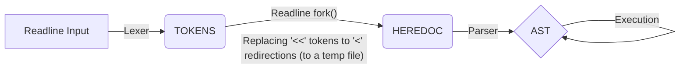

<div align="center">


</div>


> [!NOTE]\
> The aim of the `minishell` 42 project is to create a lightweight command-line interpreter that reproduces the essential features of bash. What sets this implementation apart is its robust parsing system, completely decoupled from execution, built on LALR(1) grammar principles, producing a clean and efficient Abstract Syntax Tree (AST) for command execution. This project demonstrates advanced parsing techniques and provides a basis for understanding how some modern shells interpret and execute commands.

## ✨ Features

> - 🧩 **Tokenizer**: Flexible and scalable lexical analyzer that converts raw input into meaningful tokens
> - 🔎 **Grammar Parser**: Predictive parsing using Look-Ahead LR(1) techniques
> - 🔃 **AST Generation**: Efficient Abstract Syntax Tree construction thanks to grammar production rules
> - 🔗 **Efficient Builtins**: Implementation of essential shell builtins (cd, echo, exit, etc.)
> - 🧹 **Resource Caching**: Cached file descriptors and memory allocations with automatic cleanup on program exit
> - ⚡ **Hashmap-powered Environment**: Fast O(1) environment variables access
> - 📏 **42 School Compliant**: Follows 42 School norm and coding standards

## 🚀 Getting Started

### Prerequisites

> - Clang compiler
> - GNU Make
> - readline library

### Installation

```bash
# Clone the repository
git clone --recurse-submodules https://github.com/MykleR/minishell.git

# Enter the directory and compile project
cd minishell; make

# Run the shell
./minishell
```
> [!IMPORTANT]\
> Don't forget `--recurse-submodules` otherwise dependencies will not be cloned

## 🔍 Technical Overview

### What are LR Parsers?
> An [LR parser](https://en.wikipedia.org/wiki/LR_parser) is a powerful tool used by interpreters and compilers to analyze the structure of code or commands. "LR" stands for "Left-to-right" reading of the input, building up the parse tree in a way that matches the grammar rules of a language. This type of parser works from the bottom up: it starts with the raw input (like shell commands), gradually groups symbols to form higher-level structures, and ultimately recognizes valid syntax.

### The Grammar
> This grammar formally describes the language's syntax.
> - Left side: Productions, used to represent symbols or in our case AST nodes.
> - Right side: Requirements for the production (these may be tokens ore other productions).
```
program -> list  
list -> list AND list  
list -> list OR list  
list -> list PIPE list  
list -> LBRACKET list RBRACKET  
list -> command  
redirection -> REDIR_IN arg  
redirection -> REDIR_OUT arg  
redirection -> REDIR_APP arg  
command -> arg  
command -> redirection  
command -> command arg  
command -> command redirection  
arg -> ARG
```

### Action and Goto Tables
> LR parsers rely on two main sets of instructions, called tables:
> - **[Action Table](https://en.wikipedia.org/wiki/LR_parser#Action_table):** This table tells the parser what to do next, depending on the current situation. The possible actions are:
> - ⋅⋅⋅⋅ **Shift:** Reads and places the next token from the input onto the stack, gathering more information before reducing to a grammar rule.
> - ⋅⋅⋅⋅ **Reduce:** Replaces gathered symbols on the stack with a single symbol, according to a grammar rule. (e.g., a sequence of tokens words might be reduced to a single "command" symbol)
> - ⋅⋅⋅⋅ **Accept:** Successfully finish parsing. The grammar was fully respected.
> - ⋅⋅⋅⋅ **Error:** Indicate a problem in the input. The grammar was not respected.
> - **[Goto Table](https://en.wikipedia.org/wiki/LR_parser#Goto_table):** After a reduction, the goto table tells the parser which state to move next, based on the new symbol on top of the stack.

> [!NOTE]\
> The parser uses a [stack](https://en.wikipedia.org/wiki/Stack_(abstract_data_type)) to keep track of symbols and parser states. As it shifts tokens and reduces groups of symbols, the stack helps the parser remember where it is and what structures have been recognized so far. Also Actions/Gotos tables are central data structures used in compiler construction—specifically in parsers generated by algorithms like LR parsing.

### How It’s Used in minishell
> In your minishell project, these action and goto tables are precomputed and built directly into the parsing engine. When the user enters a command, the parser uses these tables to decide what to do for each token—whether to shift, reduce, accept, or signal an error. This setup allows minishell to quickly and reliably understand complex shell command syntax, making it robust and efficient.

> [!TIP]\
> You can generate tables, test and try grammars with this online tool [LALR(1) Parser Generator](https://jsmachines.sourceforge.net/machines/lalr1.html).

## 🔄 Processing Pipeline

The execution process follows a carefully designed pipeline:
1. **Input Capture**: Utilizes GNU Readline for command input with history support
2. **Tokenization**: Breaks input into meaningful tokens
3. **Heredoc Processing**: Handles heredocs and converts them to redirections '<'
4. **AST Construction**: Builds an abstract syntax tree using the LALR(1) parser
5. **Tree Traversal**: Executes commands through post-order traversal of the binary tree


## 🛠️ Implementation Deep Dive

### Parsing Process

1. **Lexical Analysis (Tokenizing)**
   - Input string is broken down into tokens (arg, operators, redirection, etc.)
   - Each token is classified based on its role in the shell language
   - You will find an exhaustive list of all the tokens type in “headers/lexer.h”.
   - Token enum type values are very important as they are used as index in the action table

2. **Syntax Analysis (Parsing)**
   - **State Machine**: The parser maintains a state stack and a symbol stack
   - **Action/Goto Tables**: Action and GOTO tables drive the parser's state transitions, For each state, consult the action table to determine:
   - Shift (s): Push the current token onto the stack and move to next token
   - Reduce (r): Replace symbols on stack according to a production rule
   - Accept (acc): Parsing successfully completed
   - Error (empty): Syntax errors
   - Syntax errors can be precisely located and reported easily thanks to the Error state

4. **AST Construction**
   - As grammar rules are recognized, corresponding AST nodes are created
   - Nodes are connected to form a tree structure representing the command hierarchy
   - The tree captures command relationships and execution order

5. **AST Traversal and Execution**
   - The AST is traversed in post-order to respect command dependencies
   - Nodes are processed according to their type (command, redirection, logical operator)
   - Execution results propagate up the tree to determine logical branch paths and exit code status

## 📚 Further Reading

- [Compilers: Principles, Techniques, and Tools](https://en.wikipedia.org/wiki/Compilers:_Principles,_Techniques,_and_Tools)
- [LALR Parser](https://en.wikipedia.org/wiki/LALR_parser)
- [LALR Parser Generator](https://jsmachines.sourceforge.net/machines/lalr1.html)
- [Abstract Syntax Trees in Compiler Design](https://en.wikipedia.org/wiki/Abstract_syntax_tree)
- [Compilation](https://vpenelle.pages.emi.u-bordeaux.fr/compilation/poly.pdf)
- [Grammaires et language](https://amuschol.pages.emi.u-bordeaux.fr/mpc/poly.pdf)
